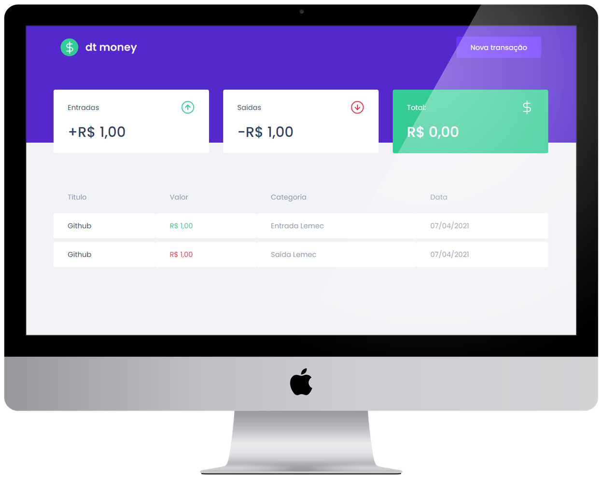

<h1 align="center">
    
</h1>

<p align="center">
  <a href="#desktop_computer-projeto"></a>&nbsp;&nbsp;&nbsp;|&nbsp;&nbsp;&nbsp;
  <a href="#nail_care-layout"></a>&nbsp;&nbsp;&nbsp;|&nbsp;&nbsp;&nbsp;
  <a href="#technologist-tecnologias"></a>&nbsp;&nbsp;&nbsp;|&nbsp;&nbsp;&nbsp;
  <a href="#octocat-ambiente"></a>&nbsp;&nbsp;&nbsp;|&nbsp;&nbsp;&nbsp;
  <a href="#bookmark_tabs-licença"></a>
</p>

<br>

<p align="center">
 
</p>

<br>
<hr>

## :desktop_computer: Projeto

<strong>DTmoney</strong> é uma aplicação web que calcula o fluxo financeiro de um determinado usuário a partir de dados de transações imputados pelo mesmo.

Esse projeto foi desenvolvido com o intuito de aprofundar conhecimentos em front-end usando a biblioteca <strong>React</strong>, no curso Ignite da [@Rocketseat](https://github.com/Rocketseat).

Realizando esta aplicação foi possível praticar e compreender conceitos importantes, tais como:
- Criar e modificar estrutura usando ```create-react-app```.
- Praticar bastante o uso de <i>componentização</i>, <i>props</i> e <i>hooks</i>.
- Consumir <b>API</b> e usar uma <b>fake-api</b>.
- Instalação e uso do <b>Axios</b>. 
- Exercitar a estratégia CSS-IN-JS com styled-components
- Teoria e pratica sobre imutabilidade.

<br>
<hr>

## :nail_care: Layout
<p align="center">

</p>

Você pode verificar o layoult completo clicando em: <a href="https://www.figma.com/file/0xmu9mj2TJYoIOubBFWsk5/dtmoney-Ignite-(Copy)?node-id=0%3A1">FIGMA</a>.

Layoult desenvolvido pelo [@TiagoLuchtenberg](https://www.instagram.com/tiagoluchtenberg/?hl=pt-br).

<br>
<hr>

## :technologist: Tecnologias

- [React](https://pt-br.reactjs.org/)
- [Babel](https://babeljs.io/)
- [WebPack](https://webpack.js.org/)
- [Typescript](https://www.typescriptlang.org/)
- [Styled Components](https://styled-components.com/)
- [Polished](https://github.com/styled-components/polished)
- [MirageJS](https://miragejs.com/ )
- [Axios](https://github.com/axios/axios)
- [React-modal](https://github.com/reactjs/react-modal)

<br>
<hr>

## :octocat: Ambiente

1. Clonar o repositório:

```bash
git@github.com:CaioLemec/dtmoney.git
```

2. Instale as dependências usando o comando:

```bash
 yarn
```

3. No seu terminal use o comando para rodar a aplicação:

```bash
yarn start
```

4. acesse o endereço em um browser compatível:

```bash
http://localhost:3000/
```
<br>
<hr>

## :bookmark_tabs: Licença

<br>

This project is licensed under the MIT [LICENSE](LICENSE.md).

<br>
<hr>
<p align="center">
<a href="caiolemec@gmail.com">
<a href="https://br.linkedin.com/in/caio-lemec/">
<br></p>

